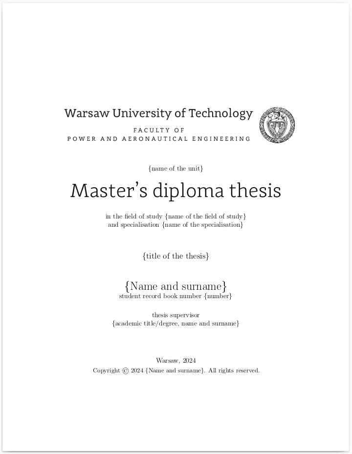

Warsaw University of Technology thesis template
==================
LaTeX template for a Warsaw University of Technology thesis. 

This template follows the guidelines specified in the [Diploma Exam](https://cs50.harvard.edu/python/2022/psets/0/) page of the Faculty of Power and Aeronautical Engineering. 

> [!IMPORTANT]
> Please note that this is NOT an official template - The requirements my change and you should check before using it.

Preview
-------

Requirements
------------
texlive-full

Reference
---------
[ri-thesis-template](https://github.com/felixduvallet/ri-thesis-template)
